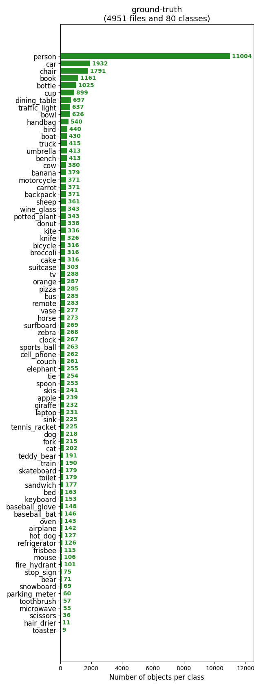
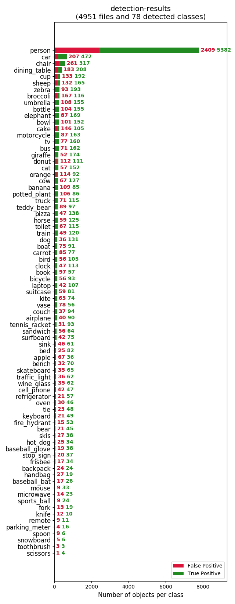
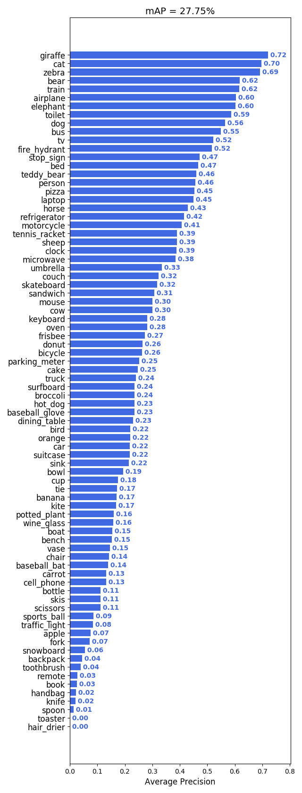
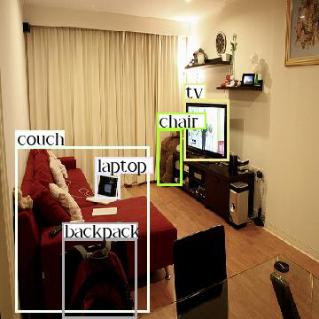
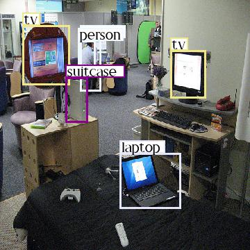
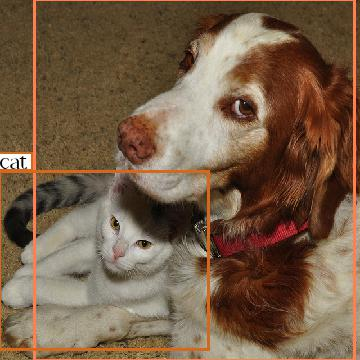
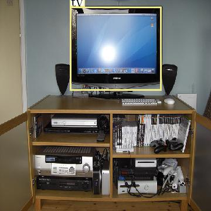

# RetinaNet
### Note:
1. Fork from https://github.com/kuangliu/pytorch-retinanet
2. Non-official implementation
3. Pytorch version - 1.1.0

# Paper reference:
[Focal Loss for Dense Object Detection](https://arxiv.org/abs/1708.02002)  

---
# Some Tables:
### The performence was not good.I'm still working on it.
### If you want to join us and find problems in this project, feel free to contact me.

1. ground-truth-info

2. detection-results-info

3. mAP

---
# Some Result images:

1. pred_033802.jpg

2. pred_213753.jpg

3. pred_251723.jpg

4. pred_456376.jpg

5. pred_574028.jpg

